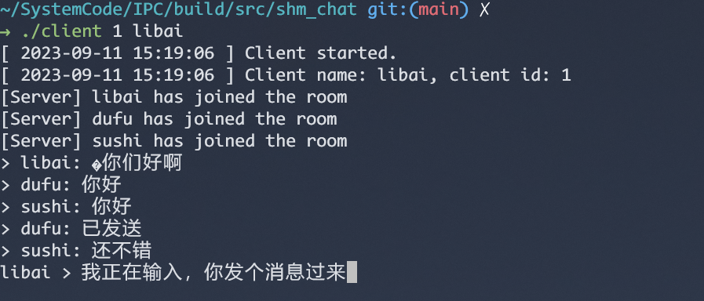
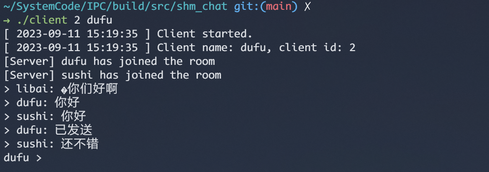
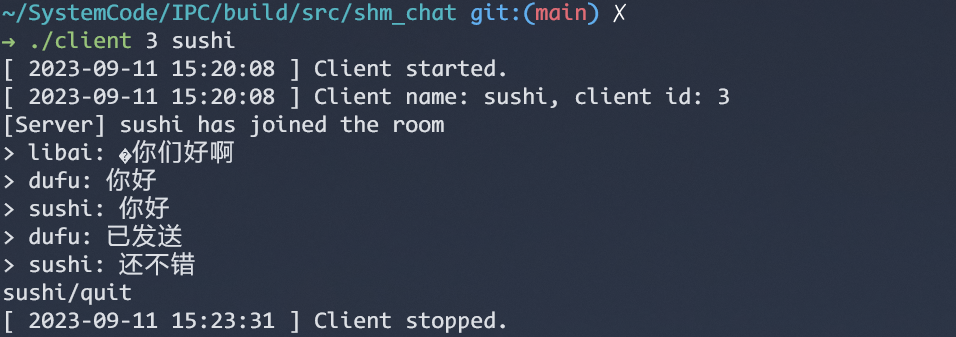
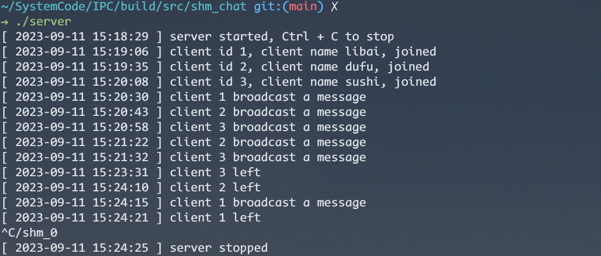

# IPC box

- shm (shm condition variables)
- pipe
- fifo
- mmap
- semaphore (shm with semaphore)
- mq
- socket local
- socket


## Usage

```sh
cmake -B build

cmake --build build
```

You can run the executable programs which are at `build/src/xxx` directories.

## Practice


- [shm_chat](./src/shm_chat): is a local multi-user chatroom based on shm and mmap.
```sh
# server compiled and run in the build directory.
./server

# client compiled and run in the build directory.
./client [client_id](1-100) [user_name]
```

> Features:
>
> 1. Mapped share memory
> 2. Ring buffer messages
> 3. Non-canonical input mode. Peer`s inputs will never interrupt current user typed input
> 4. Whisper supported
> 5. Active user inquiry supported
> 6. Graceful quit

client 1



client 2 



client 3



server



